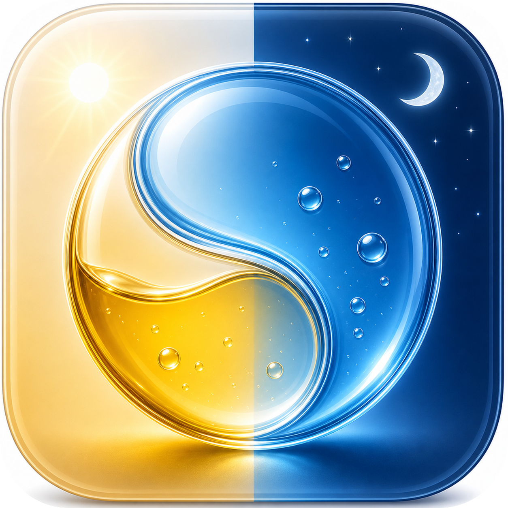

# UroBilanz

[English](README.md)

        

UroBilanz ist eine lokale Auswertung fuer Urin- und Wasserprotokolle aus
CSV-Dateien. Das Projekt enthaelt eine portable Web-App und eine native
SwiftUI-App fuer macOS.



Das aktuelle App-Symbol wurde fuer UroBilanz mit Unterstuetzung von OpenAI Codex
erzeugt. Falls eine unbeabsichtigte Aehnlichkeit zu einer anderen App auffaellt,
kann das Symbol jederzeit ersetzt werden.

## Wichtig

UroBilanz ist ein Protokoll- und Auswertungstool. Es ist keine medizinische
Diagnose-App und gibt keine medizinischen Empfehlungen.

## Funktionen

- Urin-, Wasser- und Hinweis-Eintraege aus Urinote-CSV importieren,
  zusammenfuehren und manuell ergaenzen.
- Dashboard, Tages-, Wochen-, Monats- und Jahresansichten mit Summen,
  Durchschnitt, Auffaelligkeiten und Streak-Anzeige.
- Hinweise bleiben der passenden Uhrzeit zugeordnet; allgemeine Hinweise
  bleiben separat sichtbar.
- Tabellenbreiten koennen direkt angepasst und lokal gespeichert werden.
- Themes koennen importiert, exportiert und geloescht werden.
- Arztbericht mit frei waehlbarem Zeitraum, Zusammenfassung, Tagesverlauf,
  Tagesdetails, Hinweisen und Bewertungsregeln.
- Export als Komplett-Backup, Tagesdaten-CSV, JSON und macOS-PDF-Bericht.
- Web-App und native SwiftUI-App arbeiten lokal ohne automatische
  Datenuebertragung an externe Server.

## Screenshots

Die folgenden Bilder zeigen Demo-Daten. Es sind keine echten Gesundheitsdaten.

### Web-App


### SwiftUI-App


## Voraussetzungen

- Web-App: moderner Browser auf macOS, Windows oder Linux.
- macOS-App: Apple Silicon (`arm64`), aktuell fuer macOS 26 gebaut.

## Start / Build

### Web-App

Im Ordner `apps/web` kann die Datei `Start_Urinprotokoll.command` gestartet
werden. Alternativ kann `index.html` direkt im Browser geoeffnet werden.

### macOS-App

Die gebaute App liegt hier:

`apps/macos-swift/build/UroBilanz.app`

Die macOS-App kann neu gebaut werden mit:

```bash
apps/macos-swift/build_app.sh
```

Development-Builds koennen mit eigener Bundle-ID gebaut werden, damit
Test-Einstellungen, Tabellenbreiten, importierte Themes und gemerkte Daten die
normale App nicht beeinflussen:

```bash
UROBILANZ_BUILD_CHANNEL=dev apps/macos-swift/build_app.sh
```

Das erzeugt `apps/macos-swift/build/UroBilanz Dev.app`.

### macOS-Sicherheitswarnung

> Beim ersten Oeffnen zeigt macOS moeglicherweise eine Warnung, da die App
> nicht mit einem kostenpflichtigen Apple Developer Account notarisiert ist.
>
> So oeffnest du die App trotzdem:
>
> 1. Rechtsklick auf die App-Datei.
> 2. **Oeffnen** waehlen.
> 3. Im erscheinenden Dialog **Trotzdem oeffnen** anklicken.
>
> Alternativ unter **Systemeinstellungen -> Datenschutz & Sicherheit** ganz
> unten **Trotzdem oeffnen** bestaetigen.
>
> Diese Einschraenkung betrifft nur die macOS-App. Die Web-App laeuft im
> Browser ohne jede Signierung.

## Eigene Themes

Web-App und SwiftUI-App koennen eigene Themes im JSON-Format importieren. Die
Vorlage, ein Beispiel und die Dokumentation liegen hier:

- [Theme-Vorlage](docs/themes/urobilanz-theme-template.json)
- [Beispieltheme](docs/themes/example-custom-theme.json)
- [Theme-Dokumentation](docs/themes/README.md)

Eingebaute Themes koennen aus der App heraus als bearbeitbare JSON-Kopie
exportiert werden. Importierte Themes koennen wieder geloescht werden.

## Entwicklung pruefen

Der portable Pruefablauf baut die SwiftUI-App neu und kontrolliert beide
unterstuetzten CSV-Importwege. Ohne Parameter verwendet er ausschliesslich die
kuenstlichen Testdaten aus `docs/demo`:

```bash
./verify_apps.sh
```

Optional koennen zwei eigene Testdateien angegeben werden:

```bash
./verify_apps.sh /pfad/urinote.csv /pfad/tagesdaten.csv
```

Persoenliche Messdaten werden nicht fuer die Standardpruefung benoetigt und
gehoeren weiterhin nicht ins Repository.

## Projektstruktur

```text
UroBilanz/
  apps/
    web/
      assets/js/core.js
      assets/js/medical-report.js
      assets/js/themes.js
      tests/core-smoke-test.js
    macos-swift/
      Sources/UroDataModel.swift
      Sources/UroMedicalReport.swift
      Sources/UroModels.swift
      Sources/UroCSVSupport.swift
      build_app.sh
      smoke_test.sh
  assets/
    icon/
  docs/
    HISTORY.md
    NEXT_STEPS.md
  verify_apps.sh
```

## Datenschutz

UroBilanz verarbeitet Messdaten ausschliesslich lokal auf dem Geraet. Es werden
keine Gesundheitsdaten an externe Server uebertragen.

Echte CSV-, Excel- und Backup-Dateien mit persoenlichen Messdaten gehoeren
nicht in dieses Repository. Die `.gitignore` ist so vorbereitet, dass solche
Dateien nicht versehentlich aufgenommen werden.

Der lokale technische Datenschutz-Check ist unter
[docs/PRIVACY_CHECK.md](docs/PRIVACY_CHECK.md) dokumentiert.

## Kontakt

Fragen, Feedback und Fehlerberichte koennen per E-Mail gesendet oder direkt in
der App erstellt werden.

**E-Mail:** [urobilanz@mailbox.org](mailto:urobilanz@mailbox.org)

## Lizenz

UroBilanz steht unter der GNU General Public License Version 3 (GPLv3).

**Lizenz:** [GNU GPLv3](LICENSE)

## Transparenz

UroBilanz wurde als persoenliches Auswertungs- und Protokollwerkzeug gemeinsam
mit OpenAI Codex entwickelt. Auch die im Projekt enthaltenen Grafiken, Symbole
und App-Icons wurden fuer dieses Projekt mit Unterstuetzung von OpenAI Codex
erstellt. Die medizinischen Inhalte, Grenzwerte und Darstellungen dienen nur
der persoenlichen Uebersicht und ersetzen keine medizinische Beratung.
