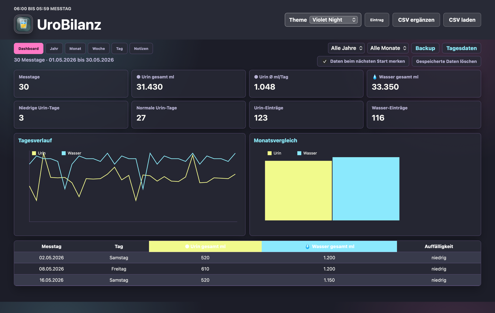
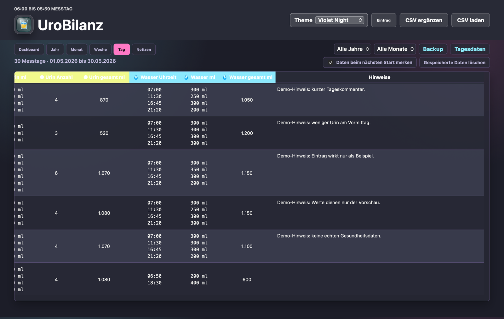
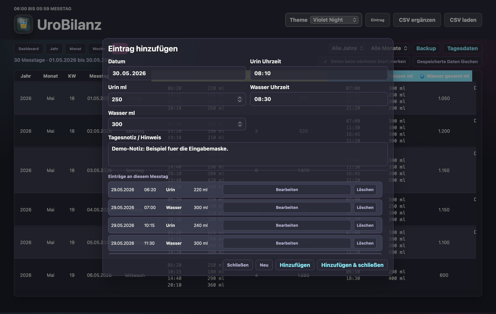
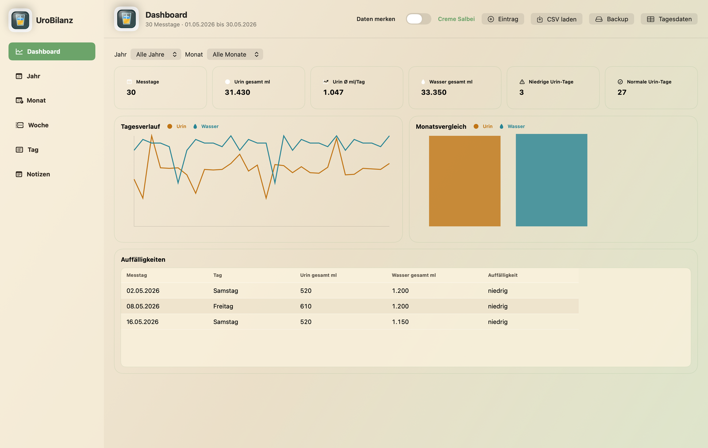
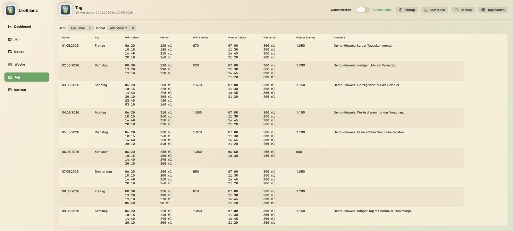
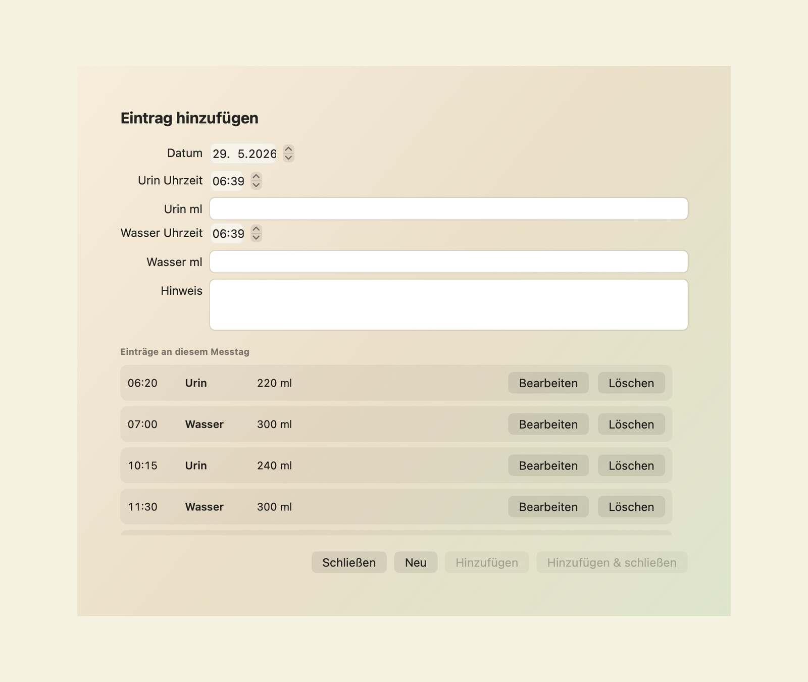

# UroBilanz

UroBilanz ist eine lokale Auswertung fuer Urin- und Wasserprotokolle aus CSV-Dateien.

Das Projekt enthaelt zwei Apps:

- `apps/web`: portable Web-App fuer macOS, Windows und Linux im Browser.
- `apps/macos-swift`: native macOS-App mit SwiftUI fuer Apple-Silicon-Macs.

## Wichtig

UroBilanz ist ein Protokoll- und Auswertungstool. Es ist keine medizinische Diagnose-App und gibt keine medizinischen Empfehlungen.

Die Verarbeitung findet lokal statt. CSV-Dateien werden nicht hochgeladen.

## Vorschau

Die folgenden Bilder zeigen Demo-Daten. Es sind keine echten Gesundheitsdaten.

### Web-App







### SwiftUI-App







## Transparenz

UroBilanz wurde als persoenliches Auswertungs- und Protokollwerkzeug gemeinsam mit OpenAI Codex entwickelt. Auch die im Projekt enthaltenen Grafiken, Symbole und App-Icons wurden fuer dieses Projekt mit Unterstuetzung von OpenAI Codex erstellt. Die medizinischen Inhalte, Grenzwerte und Darstellungen dienen nur der persoenlichen Uebersicht und ersetzen keine medizinische Beratung.

## Web-App starten

Im Ordner `apps/web` kann die Datei `Start_Urinprotokoll.command` gestartet werden. Alternativ kann `index.html` direkt im Browser geoeffnet werden.

## macOS-App starten

Die gebaute App liegt hier:

`apps/macos-swift/build/UroBilanz.app`

Die Swift-App ist aktuell fuer Apple Silicon (`arm64`) und macOS 26 gebaut.

## Eigene Themes

Ab Version `1.6.0-beta.1` koennen Web-App und SwiftUI-App eigene Themes im
JSON-Format importieren. Die Vorlage und Beispiele liegen hier:

- [Theme-Vorlage](docs/themes/urobilanz-theme-template.json)
- [Beispieltheme](docs/themes/example-custom-theme.json)
- [Theme-Dokumentation](docs/themes/README.md)

Eingebaute Themes koennen aus der App heraus als bearbeitbare JSON-Kopie
exportiert werden. Importierte Themes koennen wieder geloescht werden.

## Entwicklung pruefen

Der interne Pruefablauf baut die SwiftUI-App neu und kontrolliert beide
unterstuetzten CSV-Importwege:

```text
./verify_apps.sh
```

## Projektstruktur

```text
UroBilanz/
  apps/
    web/
      assets/js/core.js
      tests/core-smoke-test.js
    macos-swift/
      Sources/UroModels.swift
      Sources/UroCSVSupport.swift
      build_app.sh
      smoke_test.sh
  assets/
    icon/
  docs/
  verify_apps.sh
```

## Datenschutz

Echte CSV-, Excel- und Backup-Dateien mit persoenlichen Messdaten gehoeren nicht in dieses Repository. Die `.gitignore` ist so vorbereitet, dass solche Dateien nicht versehentlich aufgenommen werden.
